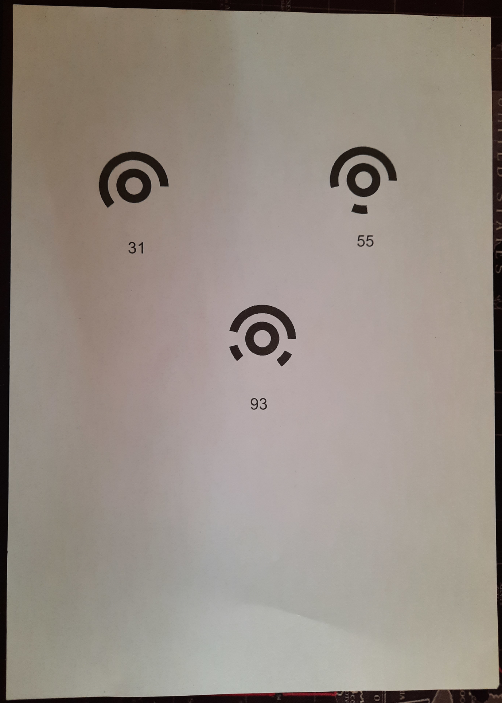
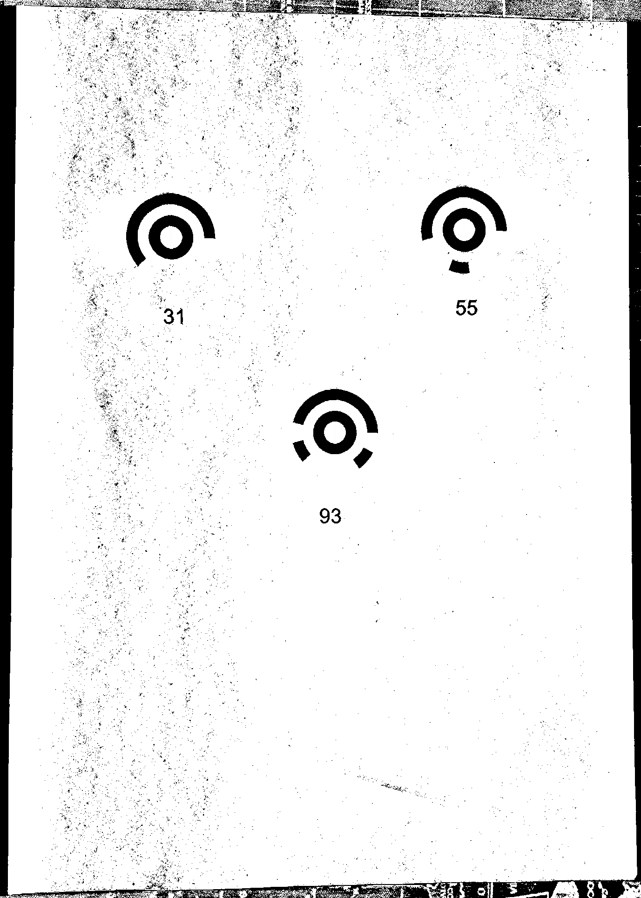
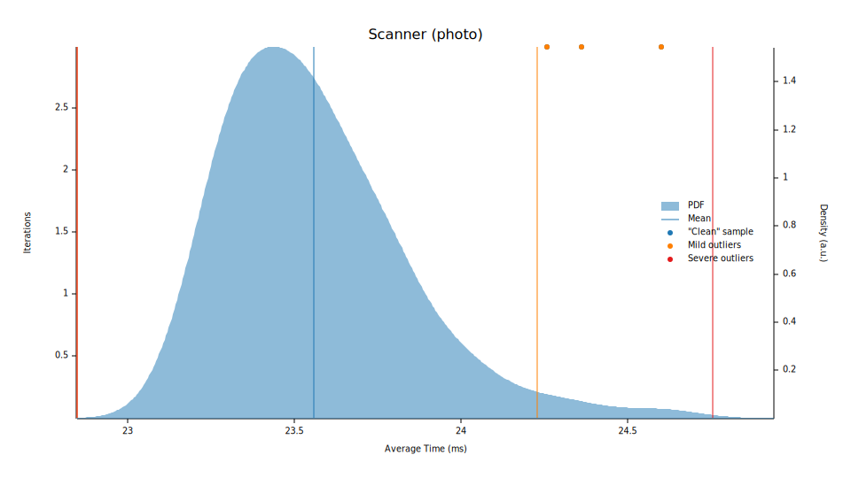
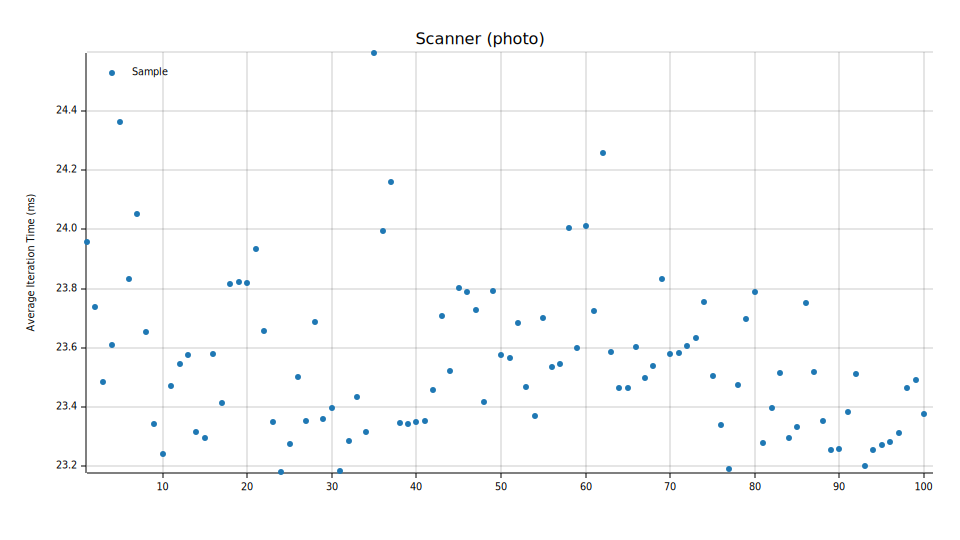

# TopCodes in Rust

This is a direct reimplementation of TopCodes in Rust. The original source by
Michael Horn can be found [here](https://github.com/TIDAL-Lab/TopCodes).

Using the image crate, the scanner can be used as follows:

```rust
use image::io::Reader as ImageReader;

let (mut scanner, buffer) = {
    let img = ImageReader::open("assets/photo.png")
        .unwrap()
        .decode()
        .unwrap();
    let (width, height) = (img.width() as usize, img.height() as usize);
    let buffer = img.into_rgb8().into_raw();
    (Scanner::new(width, height), buffer)
};

let topcodes = scanner
    .scan(&buffer, |buffer, index| {
        (
            buffer[index * 3] as u32,
            buffer[index * 3 + 1] as u32,
            buffer[index * 3 + 2] as u32,
        )
    });
```

You are free to use any abstraction as long as you can provide the scanner with
a reference to the raw image buffer (currently assumes an RGB [u8] slice).

## Demo

An example using this library in WASM can be found in the
[topcodes-wasm-rs](https://github.com/battesonb/topcodes-wasm-rs/) repository.

## Thresholding

For a peak into how the scanner works, we start with an image such as the
following:



It runs the thresholding algorithm which produces the following data in the
alpha channel (visualized as a greyscale image):



## Scanning

After the thresholding, TopCodes are determined from this black and white map.
First the candidate TopCode is ensured not to overlap existing TopCodes
(opportunity for a BVH or similar data structure to determine collisions
quickly), then unit size (width of ring) is determined, and finally the actual
code is determined. There is a checksum to ensure that the code's number of 1's
bits is equal to five to reduce the number of valid TopCodes (and thus decrease
the error rate).

## Performance

The benchmark below uses the `assets/photo.png` image and is performed on a
computer with the following specs:

CPU: Intel Core i7-9700K @ 3.60 GHz
RAM: 16.0 GB

While performance benchmarks aren't entirely reliable, this will help with
development moving forward as I don't want to regress accuracy or performance
for an improved API.





## Plans

The goal of this package is to be as agnostic of the platform as possible. All
dependencies that are not explicitly required will be feature-gated to ensure
that the default dependencies of this project are as close to zero as possible.
Ideally, this version of the project should be able to run on most/all
platforms that are supported by Rust out of the box.

I plan to create a separate repository for providing a dynamic library from this
source, so that it can be pulled in from other languages, as well.
